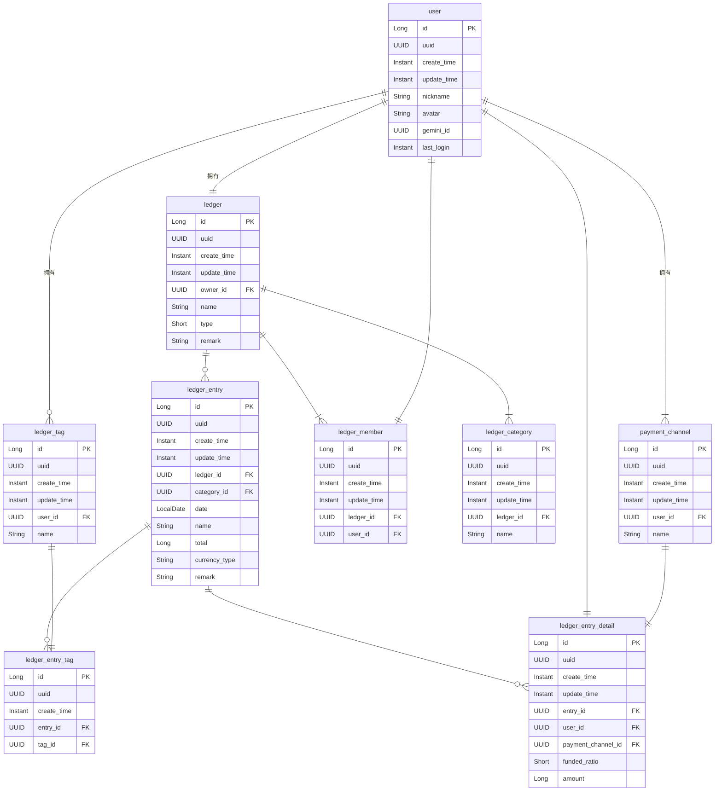

# 数据库设计

## ER图

## 账本表(ledger)

| 列名     |   长度   | 用途                                                           |
| :------- | :------: | :------------------------------------------------------------- |
| name     |    32    | 名称                                                           |
| remark   |    64    | 备注                                                           |
| owner_id |          | 账本管理员                                                     |
| type     | smallint | 账本类型： &8 = 8 -> 合作账本, &1 = 1 普通账本, &2 =2 理财账本 |

## 账本用户关联表(co_ledger_user)

仅合作账本会关联用户

| 列名        | 长度  | 用途     |
| :---------- | :---: | :------- |
| ledger_id   |       | 账本ID   |
| user_id     |       | 用户ID   |
| is_writable |       | 是否可改 |

## 账本条目分类表(ledger_category)

| 列名      | 长度  | 用途   |
| :-------- | :---: | :----- |
| ledger_id |       | 账本ID |
| name      |  16   | 名称   |

## 账本条目标签表(ledger_tag)

| 列名    | 长度  | 用途   |
| :------ | :---: | :----- |
| user_id |       | 用户ID |
| name    |  16   | 名称   |

## 账本条目表(ledger_entry)

| 列名        | 长度  | 用途     |
| :---------- | :---: | :------- |
| ledger_id   |       | 账本ID   |
| category_id |       | 分类ID   |
| date        |       | 产生时间 |
| amount      |       | 金额     |
| remark      |  64   | 备注     |

## 帐本条目标签关联表(ledger_entry_tag)

| 列名     | 长度  | 用途   |
| :------- | :---: | :----- |
| entry_id |       | 条目ID |
| tag_id   |       | 标签ID |

## 合作账本条目组成表(co_ledger_entry_)

| 列名     | 长度  | 用途   |
| :------- | :---: | :----- |
| entry_id |       | 条目ID |
| user_id  |       | 用户ID |
| amount   |       | 金额   |

## 用户表(system_user)

| 列名     | 长度  | 用途    |
| :------- | :---: | :------ |
| username |  16   | 用户名  |
| password |  36   | 密码    |
| salt     |  36   | 盐      |
| nickname |  16   | 昵称    |
| avatar   |  64   | 头像URL |

## 理财条目表(financial_entry)

| 列名      | 长度  | 用途     |
| :-------- | :---: | :------- |
| ledger_id |       | 账本ID   |
| date      |       | 产生时间 |
| amount    |       | 金额     |
| remark    |  64   | 备注     |
